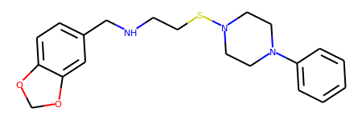

# Scaffold Network Generator
## Usage
```bash
python output.py --np=50 --file_input=data/datasets/input.txt --scaffolds_output=data/datasets/scaffolds.smi --file_output=data/datasets/scaffolds.bin 
```
## Read the entire scaffolds message from a file
```python
from data import *
from rdkit import Chem
from rdkit.Chem.Draw import IPythonConsole
dic = DicSmScaffoldLs()
with open('data/datasets/scaffolds.bin','rb') as f:
    dic.ParseFromString(f.read())
    
print(len(dic.smiles_scaffold))

print(scaffold_smiles_idx(6))

print(len(dic.smiles_scaffold[scaffold_smiles_idx(6)].dic_mol_atoms))

print(dic.smiles_scaffold[scaffold_smiles_idx(6)].dic_mol_atoms[0].idx_mol)

print(dic.smiles_scaffold[scaffold_smiles_idx(6)].dic_mol_atoms[0].ls_atom)


```
```python
340089
c1ccc(N2CCN(SCCNCc3ccc4c(c3)OCO4)CC2)cc1
5
59259
idx_atom: 1
idx_atom: 2
idx_atom: 3
idx_atom: 4
idx_atom: 5
idx_atom: 8
idx_atom: 9
idx_atom: 10
idx_atom: 11
idx_atom: 12
idx_atom: 13
idx_atom: 14
idx_atom: 15
idx_atom: 17
idx_atom: 18
idx_atom: 19
idx_atom: 20
idx_atom: 21
idx_atom: 22
idx_atom: 23
idx_atom: 24
idx_atom: 25
idx_atom: 26
idx_atom: 27
idx_atom: 28
idx_atom: 29
```

### The $6^{th}$ scaffold

```python
Chem.MolFromSmiles(scaffold_smiles_idx(6))
```




### The $59259^{th}$ molecule containing the $6^{th}$ scaffold

```python
Chem.MolFromSmiles(smiles_from_line(59259))
```


