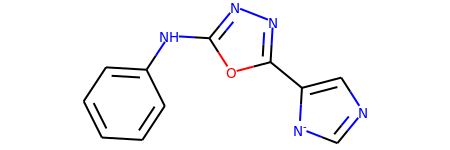

# Scaffold Network Generator
## Usage
```bash
python output.py --np=50 --file_input=data/datasets/input.smi --scaffolds_output=data/datasets/scaffolds.smi --file_output=data/datasets/scaffolds.bin 
```
## Read the entire scaffold message from a file


```python
from data import *
from rdkit import Chem
from rdkit.Chem.Draw import IPythonConsole
dic = DicSmScaffoldLs()
with open('data/datasets/scaffolds.bin','rb') as f:
    dic.ParseFromString(f.read())
    
print(len(dic.smiles_scaffold))

print(scaffold_smiles_idx(6))
```

    411095
    c1ccc(Nc2nnc(-c3cnc[n-]3)o2)cc1


### Get the 6th scaffold


```python
Chem.MolFromSmiles(scaffold_smiles_idx(6))
```





```python
dic.smiles_scaffold[scaffold_smiles_idx(6)]
```


    dic_mol_atoms {
      idx_mol: 52564
      ls_atom {
        idx_atom: 1
        idx_atom: 2
        idx_atom: 3
        idx_atom: 4
        idx_atom: 13
        idx_atom: 14
        idx_atom: 15
        idx_atom: 16
        idx_atom: 17
        idx_atom: 18
        idx_atom: 19
        idx_atom: 20
        idx_atom: 21
        idx_atom: 22
        idx_atom: 24
        idx_atom: 25
        idx_atom: 26
      }
    }
    dic_mol_atoms {
      idx_mol: 354436
      ls_atom {
        idx_atom: 1
        idx_atom: 2
        idx_atom: 3
        idx_atom: 4
        idx_atom: 5
        idx_atom: 6
        idx_atom: 7
        idx_atom: 8
        idx_atom: 9
        idx_atom: 10
        idx_atom: 11
        idx_atom: 12
        idx_atom: 21
        idx_atom: 22
        idx_atom: 23
        idx_atom: 25
        idx_atom: 26
      }
    }
    dic_mol_atoms {
      idx_mol: 487496
      ls_atom {
        idx_atom: 2
        idx_atom: 3
        idx_atom: 4
        idx_atom: 5
        idx_atom: 6
        idx_atom: 7
        idx_atom: 8
        idx_atom: 9
        idx_atom: 10
        idx_atom: 11
        idx_atom: 12
        idx_atom: 13
        idx_atom: 14
        idx_atom: 23
        idx_atom: 24
        idx_atom: 25
        idx_atom: 27
      }
    }
    dic_mol_atoms {
      idx_mol: 505606
      ls_atom {
        idx_atom: 1
        idx_atom: 2
        idx_atom: 3
        idx_atom: 4
        idx_atom: 13
        idx_atom: 14
        idx_atom: 15
        idx_atom: 16
        idx_atom: 17
        idx_atom: 18
        idx_atom: 19
        idx_atom: 20
        idx_atom: 21
        idx_atom: 22
        idx_atom: 24
        idx_atom: 25
        idx_atom: 26
      }
    }
    dic_mol_atoms {
      idx_mol: 603205
      ls_atom {
        idx_atom: 2
        idx_atom: 3
        idx_atom: 4
        idx_atom: 5
        idx_atom: 6
        idx_atom: 7
        idx_atom: 8
        idx_atom: 9
        idx_atom: 10
        idx_atom: 11
        idx_atom: 12
        idx_atom: 13
        idx_atom: 22
        idx_atom: 23
        idx_atom: 24
        idx_atom: 26
        idx_atom: 27
      }
    }
    dic_mol_atoms {
      idx_mol: 744798
      ls_atom {
        idx_atom: 1
        idx_atom: 2
        idx_atom: 3
        idx_atom: 4
        idx_atom: 5
        idx_atom: 6
        idx_atom: 7
        idx_atom: 8
        idx_atom: 9
        idx_atom: 10
        idx_atom: 11
        idx_atom: 12
        idx_atom: 13
        idx_atom: 22
        idx_atom: 23
        idx_atom: 24
        idx_atom: 26
      }
    }
    dic_mol_atoms {
      idx_mol: 868788
      ls_atom {
        idx_atom: 1
        idx_atom: 2
        idx_atom: 3
        idx_atom: 4
        idx_atom: 13
        idx_atom: 14
        idx_atom: 15
        idx_atom: 16
        idx_atom: 17
        idx_atom: 18
        idx_atom: 19
        idx_atom: 20
        idx_atom: 21
        idx_atom: 22
        idx_atom: 24
        idx_atom: 25
        idx_atom: 26
      }
    }
    dic_mol_atoms {
      idx_mol: 906593
      ls_atom {
        idx_atom: 1
        idx_atom: 2
        idx_atom: 3
        idx_atom: 4
        idx_atom: 5
        idx_atom: 6
        idx_atom: 7
        idx_atom: 8
        idx_atom: 9
        idx_atom: 10
        idx_atom: 11
        idx_atom: 20
        idx_atom: 21
        idx_atom: 22
        idx_atom: 24
        idx_atom: 25
        idx_atom: 27
      }
    }


### The 487,496th molecule containing the 6th scaffold


```python
Chem.MolFromSmiles(smiles_from_line(487496))
```


