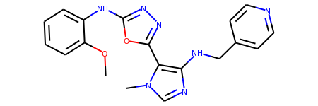
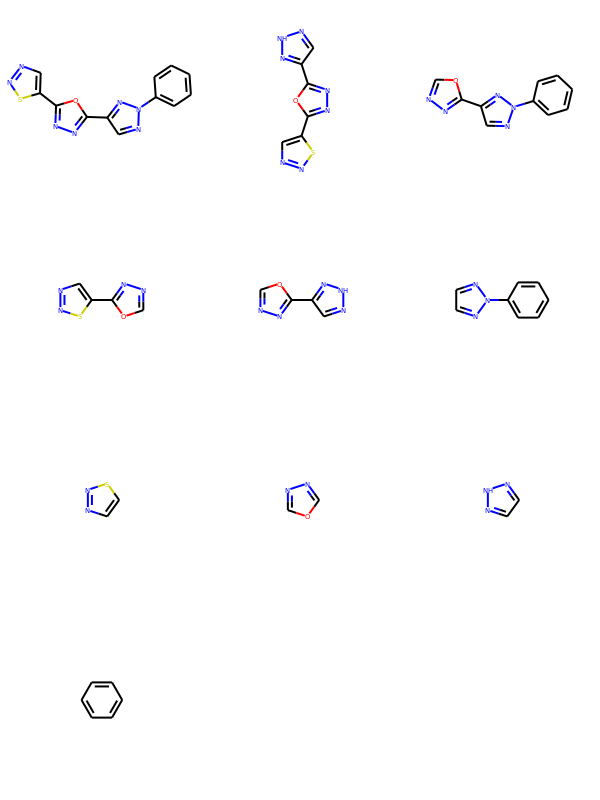

# Scaffold Network Generator


[](https://996.icu/#/en_US)
[](https://github.com/996icu/996.ICU/blob/master/LICENSE)
[](https://join.slack.com/t/996icu/shared_invite/enQtNTg4MjA3MzA1MzgxLWQyYzM5M2IyZmIyMTVjMzU5NTE5MGI5Y2Y2YjgwMmJiMWMxMWMzNGU3NDJmOTdhNmRlYjJlNjk5ZWZhNWIwZGM)

## Contributers
[](https://sourcerer.io/fame/jach4/jach4/scaffold_network_generator/links/0)[](https://sourcerer.io/fame/jach4/jach4/scaffold_network_generator/links/1)[](https://sourcerer.io/fame/jach4/jach4/scaffold_network_generator/links/2)[](https://sourcerer.io/fame/jach4/jach4/scaffold_network_generator/links/3)[](https://sourcerer.io/fame/jach4/jach4/scaffold_network_generator/links/4)[](https://sourcerer.io/fame/jach4/jach4/scaffold_network_generator/links/5)[](https://sourcerer.io/fame/jach4/jach4/scaffold_network_generator/links/6)[](https://sourcerer.io/fame/jach4/jach4/scaffold_network_generator/links/7)
>>>>>>> 
## Usage

```bash
git clone git@github.com:jach4/scaffold_network_generator.git sng
cd sng
python scaffolds_output.py --np=50 --file_input=data/datasets/input.smi --scaffolds_output=data/datasets/idx_sm.bin --file_output=data/datasets/idx_ls.bin 
```
## Read the entire scaffold message from a file


```python
from data import *
from rdkit import Chem
from rdkit.Chem import Draw
from rdkit.Chem.Draw import IPythonConsole

dic_scaffold = DicIdxLs()
with open('data/datasets/idx_ls.bin', 'rb') as f:
    dic_scaffold.ParseFromString(f.read())
dic_idx_sm = DicIdxSm()
with open('data/datasets/idx_sm.bin', 'rb') as f:
    dic_idx_sm.ParseFromString(f.read())

print(len(dic.smiles_scaffold))
```

    402344


### Get the 1990th scaffold


```python
print(dic_idx_sm.sm_sc[1990])
Chem.MolFromSmiles(dic_idx_sm.sm_sc[1990])
```

    c1n[nH]nc1-c1nnc(-c2cnns2)o1


```python
dic_scaffold.smiles_scaffold[1990]
```


    dic_mol_atoms {
      idx_mol: 111921
      ls_atom {
        idx_atom: 1
        idx_atom: 2
        idx_atom: 3
        idx_atom: 10
        idx_atom: 11
        idx_atom: 12
        idx_atom: 13
        idx_atom: 14
        idx_atom: 15
        idx_atom: 16
        idx_atom: 17
        idx_atom: 18
        idx_atom: 19
        idx_atom: 20
        idx_atom: 22
      }
      ls_nh {
        idx_atom: 3
      }
      ls_np {
      }
    }


### The 111,921th molecule containing the 1990th scaffold


```python
Chem.MolFromSmiles(smiles_from_line(111921))
```



### Get the scaffold network of The 111,921th molecule


```python
scaffold_list = get_mol_graph(smiles_from_line(111921)).ls_mol_from_sng_u()
```


```python
Draw.MolsToGridImage(scaffold_list)
```




